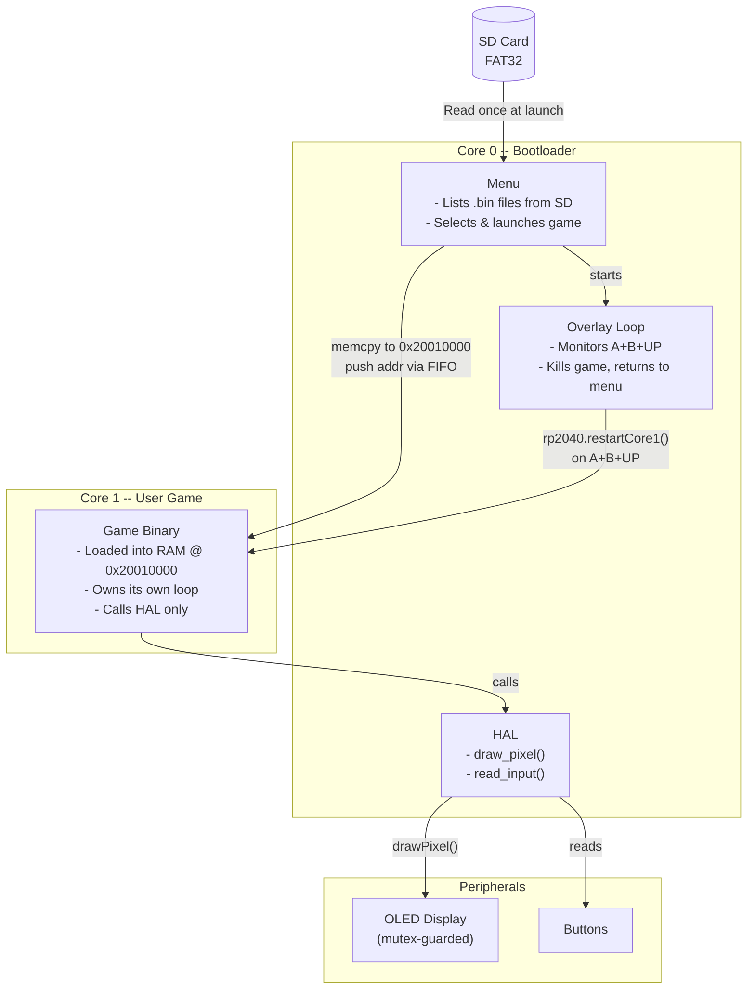

# game_console
name tbd

## Firmware Block Diagram

## Folders

- `bootloader/` - Core bootloader firmware for the RP2040 that runs on Core 0. You don't need to touch this unless you want to.
- `game/` - Template game project structure and example game firmware that runs on Core 1. This is the base template for developing new games.
- `pcb/` - Hardware design files including the KiCad PCB schematic, layout, footprints library, and production files (BOM, positions, netlist).
- `test-games/` - Test games and development utilities for validation and demonstration purposes.

## Notes 

- Everything is incredibly rudimentary and you shouldn't expect us to respond to issues. We welcome contributions though, so if you want to add features or fix bugs, fork the repo and send a PR.
- Add your game to the [discussions tab](https://github.com/CircuitReeRUG/game_console/discussions/4)! We would love to see what you make with this!
- You can tag @frogspyder on the Cover Discord server if you want to chat about anything related to this project and/or drop by in the [Discord thread](https://discord.com/channels/1073220526585159681/1484931557876826284).
